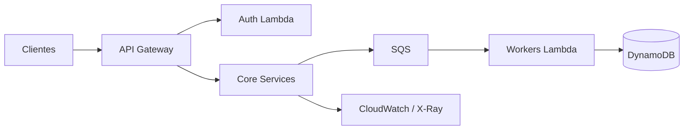

## Problema

Serviços críticos rodavam em funções legadas, com deploy manual e pouca observabilidade. Qualquer mudança exigia janela longa e rollback difícil.

## Contexto

O produto já atendia clientes em produção; não havia espaço para um big bang. A equipe precisava evoluir arquitetura sem parar entregas de negócio.

## Decisões

- Migrar por domínio (bounded context), não por camada técnica isolada.
- Introduzir contratos versionados entre serviços antes de trocar runtime.
- Padronizar pipelines com testes de contrato e deploy progressivo (canary quando possível).
- Centralizar logs e traces por correlation id desde o primeiro slice migrado.

## Arquitetura

Cada slice novo entra atrás do mesmo API Gateway; filas desacoplam picos e retries. Observabilidade compartilhada evita caixas-pretas durante a migração.

## Resultado

Deploys passaram a ser semanais com rollback em minutos. Incidentes relacionados a configuração manual caíram após padronizar IaC e contratos. O time ganhou confiança para migrar o próximo domínio sem freeze de features.

## O que eu faria diferente

Começaria o mapa de dependências entre funções uma sprint antes — perdemos tempo redescobrindo acoplamentos escondidos em variáveis de ambiente. Também documentaria SLAs por domínio antes da primeira migração para priorizar melhor.
